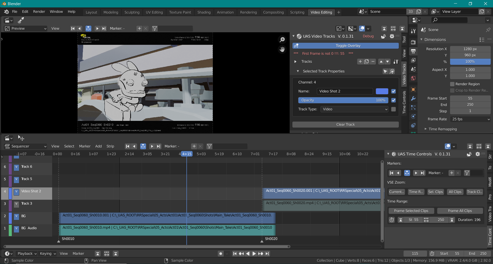

# Ubisoft Video Tracks - Blender Add-on

 

**Video Tracks is a Blender add-on that provides track headers to the channels of the VSE.**

  
  &nbsp;&nbsp;&nbsp;
  
  &nbsp;&nbsp;&nbsp;
  

**Disclaimer**
>**This tool is currently supported for LTS version of Blender 2.93 and up to Blender 3.0**
>
>It was initialy developed for an animated TV series production in 2020 on Blender 2.83. It improved a bit the use of the VSE
and has a set of features that was helpful for us at the time. It should be seen as an experimental tool and cannot be
considered as feature complete, neither for production nor even for a more generic purpose.

In spite of all our efforts to make it reliable some troubles may occur in use cases we have not faced.

 

Note that development is on Windows 10. Please report issues and submit PRs for other OSs.

## Purpose

Video Tracks improves the manipulation of the strip channels in the Video Sequence Editor.
It provides a more conventional UI for these channels, making them look and - as much as possible - feel
like video and audio tracks existing in classic editing software. Each channel then gets a "header", an area where it receives
a name and where its content can be globaly controlled.
This is very convenient for previz and 3D layout.

 

  

## Installation:
Video Tracks can be installed as any standard Blender add-on. Nevertheless:

>**The addon must be installed in Administrator mode** so that the OpenTimelineIO Python wheel can
>be downloaded and deployed correctly. Also be sure that your firewall doesn't block the download (or use OpenVPN or equivalent).

Launch Blender, open the Preferences panel and go to the Add-ons section. Press the Install button located at the top of the panel. A dialog box opens, pick the Video Tracks zip file you previously downloaded and validate. The add-on will be installed. Click on the checkbox at the left side of its name to enable it.
Once the addon is enabled, a Video Tracks tab is displayed in the VSE N-Panel.

Now close Blender to save your user preferences with the Video Tracks installation.

## Features

- Several type of tracks are available: Audio, Video, Mixed... Some of them are experimental.
 

**Tools:**

- Markers Navigation Bar: A set of buttons allowing fast and easy navigation between markers
- Time Control Bar: Better control on scene time range as well as on VSE zoom range

# History
[Change Log](./CHANGELOG.md)
